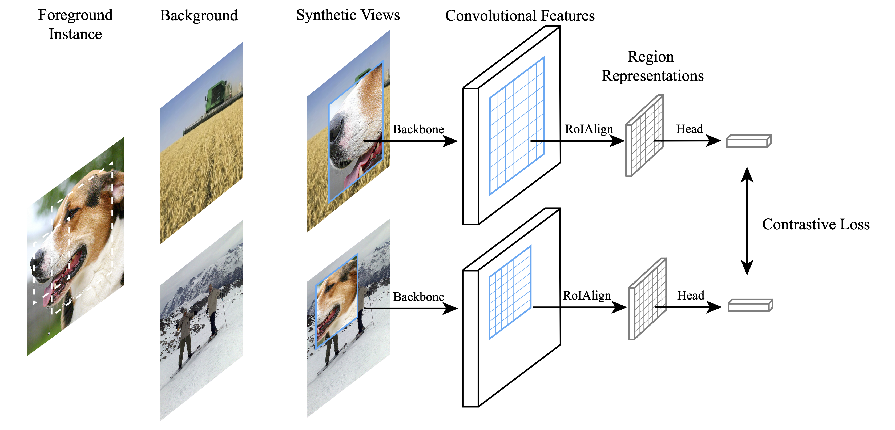

# Instance Localization for Self-supervised Detection Pretraining


[paper]

## News
- Full codebase and models are coming soon

## Main Results

Here we list the results on MSCOCO with the detector of R50-C4 and R50-FPN. Without any multi-crop/auto/random augmentation, our InsLoc outperforms many previous contrastive methods. In order to clearly clarify the improvements brought by InsLoc, the comparison to the corresponding baseline (i.e., MoCo-v2) is as follows:

Mask R-CNN **R50-C4 1x**: 
| Methods | Epoch | Box AP | Mask AP | Link | 
| :---: | :------: | :--------: | :------: | :------: | 
| MoCo-v2 | 200 | 38.9 | 34.1 | -    |
| MoCo-v2 | 800 | 39.3 | 34.3 | -    |
| InsLoc  | 200 | 39.5 | 34.5 | link |
| InsLoc  | 400 | 39.8 | 34.7 | link |

Mask R-CNN **R50-C4 2x**: 
| Methods | Epoch | Box AP | Mask AP | Link | 
| :---: | :------: | :--------: | :------: | :------: | 
| MoCo-v2 | 200 | 40.7 | 35.6 | -    |
| MoCo-v2 | 800 | 41.2 | 35.8 | -    |
| InsLoc  | 200 | 41.4 | 35.9 | link |
| InsLoc  | 400 | 41.8 | 36.3 | link |

Mask R-CNN **R50-FPN 1x**: 
| Methods | Epoch | Box AP | Mask AP | Link | 
| :---: | :------: | :--------: | :------: | :------: | 
| MoCo-v2 | 200 | 39.8 | 36.1 | -    |
| MoCo-v2 | 800 | 40.4 | 36.4 | -    |
| InsLoc  | 200 | 41.4 | 37.1 | link |
| InsLoc  | 400 | 42.0 | 37.6 | link |

Mask R-CNN **R50-FPN 2x**: 
| Methods | Epoch | Box AP | Mask AP | Link | 
| :---: | :------: | :--------: | :------: | :------: | 
| MoCo-v2 | 200 | 41.7 | 37.6 | -    |
| MoCo-v2 | 800 | 42.5 | 38.2 | -    |
| InsLoc  | 200 | 43.2 | 38.7 | link |
| InsLoc  | 400 | 43.3 | 38.8 | link |

More results are available in our paper.


## Bibtex
```
@inproceedings{yang2021insloc,
  title={Instance Localization for Self-supervised Detection Pretraining},
  author={Yang, Ceyuan and Wu, Zhirong and Zhou, Bolei and Lin, Stephen},
  booktitle={arXiv preprint},
  year={2021},
}
```
